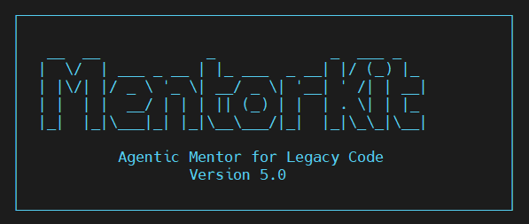

<p align="center">
  
</p>

# mentorkit

> Orquestador de workflow para juniors. Constitution → Spec → Fingerprinting → Plan → Confirm → Implement → PR.

**Plataforma:** Linux · macOS · Windows (Git Bash o WSL2) · **Python:** 3.12.13 (pin exacto) · **Deps lockeadas:** 60 con SHA256

---

## 🚀 Instalación rápida (en tu proyecto)

Si quieres usar MentorKit en tu proyecto (sin clonar este repo):

```bash
bash <(curl -fsSL "https://raw.githubusercontent.com/thewild001/MentorKit/main/bootstrap.sh")
```

El bootstrap:

1. Descarga el tarball del repo.
2. Copia `.opencode/` y `Makefile` al proyecto destino.
3. Ejecuta `.opencode/install-mentorkit.sh --fix`.
4. Deja el entorno verificado y listo para usar.

> No hace falta correr `make install` después del one-liner.

Ver detalles en [`bootstrap.sh`](./bootstrap.sh) y en [`.opencode/agents/MentorKit5.0.md`](./.opencode/agents/MentorKit5.0.md).

---

## 🪟 Windows

Usa siempre shell POSIX:

- **Git Bash** (Git for Windows)
- **WSL2**

Ejecuta el mismo one-liner desde ese shell.

---

## 🛠 Desarrollo de MentorKit (este repositorio)

```bash
git clone https://github.com/thewild001/MentorKit.git
cd MentorKit
make install
```

### Targets disponibles

| Target | Qué hace |
|---|---|
| `make help` | Muestra ayuda de targets |
| `make install` | Crea/repara venv (Python 3.12.13 + lock) |
| `make verify` | Verifica Python + imports críticos |
| `make clean` | Elimina venv y `python-path.txt` |
| `make ci` | Simula CI local (`install` + `verify` + assert JSON) |
| `make archive-spec` | Aplica delta de un `spec.md` al `openspec/system-spec.md` y archiva el spec |
| `make init-constitution` | Genera/regenera `openspec/memory/constitution.md` |
| `make all` | Alias de `install` |

---

## 📦 ¿Qué contiene el repo?

- `bootstrap.sh` — one-liner installer.
- `.opencode/install-mentorkit.sh` — instalación/verificación/reparación del entorno.
- `.opencode/mentorkit-verify.sh` — verificación standalone (exit 0/1, salida JSON opcional).
- `.opencode/mentorkit-archive-spec.sh` — merge delta + archive de specs.
- `.opencode/mentorkit-init-constitution.sh` — render de constitución desde template + fingerprint.
- `.opencode/requirements.lock` — lock con hashes.
- `.opencode/skills/` — 20 skills (core + superpowers).
- `.opencode/agents/MentorKit5.0.md` — agente principal.
- `openspec/` — store canónico de specs/constitution/system-spec.
- `.gitlab-ci.yml` — pipeline de verificación.
- `Makefile` — entry point local.

---

## 🔒 Garantías del entorno (CI)

La CI actual ejecuta **4 jobs** paralelos (`verify-install`, `verify-platform-coverage`, `verify-archive-spec`, `verify-spec-history`) para cubrir **7 garantías**:

1. Python 3.12.13 pin exacto.
2. Lock con hashes SHA256.
3. `uv` autocontenido en el venv.
4. `mentorkit-verify.sh` PASS.
5. Cobertura cross-platform del lock (`--universal`).
6. `archive-spec` operacional + validación de specs in-progress.
7. Historial de specs en git (working tree de `openspec/` limpio para archives).

---

## 📐 Flujo de specs (single-path en `openspec/`)

MentorKit usa `openspec/` como store canónico:

- Specs in-progress: `openspec/specs/<NNN>-<slug>/spec.md`
- System spec consolidado: `openspec/system-spec.md`
- Constitución: `openspec/memory/constitution.md`
- Archives: `openspec/changes/archive/<YYYY-MM-DD>-<slug>/...`

### `make archive-spec`

Ejemplos:

```bash
# Dry-run
DRY_RUN=1 make archive-spec SPEC=openspec/specs/001-archive-spec/spec.md

# Aplicar delta + archivar
make archive-spec SPEC=openspec/specs/001-archive-spec/spec.md

# Aplicar + archivar + commit automático
COMMIT=1 make archive-spec SPEC=openspec/specs/001-archive-spec/spec.md

# Re-archivar forzando overwrite
FORCE=1 make archive-spec SPEC=openspec/specs/001-archive-spec/spec.md
```

Flags/vars soportadas por el script:

- `--dry-run` / `DRY_RUN=1`
- `--force` / `FORCE=1`
- `--commit` / `COMMIT=1`
- `--no-commit` / `COMMIT=0`
- `--force-dirty` / `FORCE_DIRTY=1`

### `make init-constitution`

```bash
make init-constitution
DRY_RUN=1 make init-constitution
NO_FINGERPRINT=1 make init-constitution
NO_GRAPH=1 make init-constitution
FORCE=1 make init-constitution
```

Notas:

- El target default es `openspec/memory/constitution.md`.
- `--target` existe por compatibilidad pero está deprecado/ignorado por el script.

---

## 📜 Historial de requirements

Comandos útiles:

```bash
# Historial del system-spec
git log --follow -- openspec/system-spec.md

# Diff de un commit de archive
git show <sha>

# Auditoría por línea
git blame openspec/system-spec.md
```

---

## 🤝 Contribuir

1. `make install`
2. Crea rama: `git checkout -b feat/mi-feature`
3. Haz cambios y commits atómicos
4. Ejecuta `make verify` (y opcional `make ci`)
5. Push y abre PR en GitHub

---

## 📜 Créditos

Desarrollado por [thewild001](https://github.com/thewild001) · Universidad de las Ciencias Informáticas (UCI)

Repositorio: [github.com/thewild001/MentorKit](https://github.com/thewild001/MentorKit)
