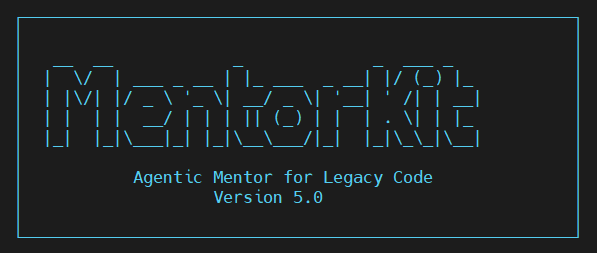

<p align="center">
  
</p>

# MentorKit

> **Agentic engineering workflow para desarrolladores**, construido sobre OpenCode y orientado a aplicar **Organic Driven Development (ODD)** de forma proporcional al cambio.

MentorKit no pretende imponer una ceremonia para cada modificación. Su objetivo es que el agente determine **cuánto proceso necesita realmente el trabajo**: desde un cambio pequeño y autocontenido hasta una feature sustancial que requiere contexto persistente, tareas, verificación y unidades de entrega revisables.

**Plataformas:** Linux · macOS · Windows (PowerShell nativo, además de Git Bash/WSL2)  
**Compatibilidad:** instalación y runtime diseñados para los tres SO; CI de smoke test en runners Linux/macOS/Windows  
**Python:** 3.12.13  
**Runtime:** OpenCode + skills MentorKit  
**Workflow:** ODD — SMALL / SUBSTANTIAL

---

## 🚀 Instalación en un proyecto

Desde la raíz del proyecto donde quieres utilizar MentorKit:

```bash
bash <(curl -fsSL "https://raw.githubusercontent.com/thewild001/MentorKit/main/bootstrap.sh")
```

El one-liner:

1. Descarga el release de MentorKit desde GitHub.
2. Instala `.opencode/`, `odd/`, la plantilla `.mentor/` y el `Makefile`.
3. Prepara el runtime Python aislado en `.opencode/.mentorkit/venv/`.
4. Instala las dependencias desde `requirements.lock`.
5. Verifica el entorno.
6. Deja OpenCode listo para utilizar el agente `MentorKit5.0`.

**No requiere clonar MentorKit ni ejecutar un segundo comando de instalación.**

### Instalación nativa en Windows\n\nPowerShell no requiere Git Bash para la instalación:\n\n```powershell\npowershell -ExecutionPolicy Bypass -File .\\bootstrap.ps1\n```\n\nDespués puedes verificar con:\n\n```powershell\npowershell -ExecutionPolicy Bypass -File .\\.opencode\\mentorkit-verify.ps1\n```\n\nEn Linux y macOS, `bootstrap.sh` y los launchers `.sh` son la ruta POSIX recomendada. El `Makefile` sigue siendo una interfaz de desarrollo POSIX; no es un requisito del runtime.\n\n### Probar una rama experimental

La instalación puede apuntar a cualquier rama:

```bash
MENTORKIT_BRANCH=feature/odd-migration \
bash <(curl -fsSL "https://raw.githubusercontent.com/thewild001/MentorKit/feature/odd-migration/bootstrap.sh")
```

Esto permite probar una versión experimental sin tocar `main`.

> El instalador no contiene credenciales ni depende de un GitLab privado.

---

## 🧠 ¿Qué es ODD en MentorKit?

**Organic Driven Development** es el modelo de orquestación de MentorKit.

La idea central es sencilla:

> **No todos los cambios necesitan el mismo nivel de proceso.**

El agente comienza determinando si la solicitud autoriza una modificación y después explora el codebase antes de decidir cómo proceder.

```
Request
   ↓
Authorization
   ↓
Explore
   ↓
Resolve uncertainty
   ↓
Classify
   ├────────────── SMALL
   │                 ↓
   │             Implement
   │                 ↓
   │              Verify
   │                 ↓
   │              Commit
   │                 ↓
   │              Close
   │
   └──────────── SUBSTANTIAL
                     ↓
             odd/tasks/<feature>.md
                     ↓
                Specs S#
                Tasks T#
                     ↓
             Implement task-by-task
                     ↓
                  Verify
                     ↓
             Work-unit Commit
                     ↓
                Review / PR
                     ↓
                  Close
```

### SMALL

Un cambio es candidato a **SMALL** cuando:

- está completamente entendido;
- tiene alcance contenido;
- existe un patrón claro en el codebase;
- el blast radius es bajo;
- no requiere decisiones materiales;
- puede recuperarse razonablemente desde la solicitud y el estado de Git.

Ejemplos:

- typo;
- ajuste localizado;
- pequeño cambio de configuración;
- test de regresión sencillo;
- corrección puntual.

No se crea automáticamente un documento persistente.

### SUBSTANTIAL

Un cambio es **SUBSTANTIAL** cuando requiere contexto durable o coordinación significativa.

Por ejemplo:

- cruza varios módulos;
- contiene lógica de negocio no trivial;
- requiere investigación;
- implica decisiones arquitectónicas;
- tiene blast radius significativo;
- necesita varias tareas;
- debe poder reanudarse después de una interrupción.

Antes del primer cambio de código se crea:

```
odd/tasks/<feature-name>.md
```

Ese documento contiene:

- `Objective`
- `Specs` — S1, S2, ...
- `Tasks` — T1, T2, ...
- `Verification`
- `Log`
- `Delivery`

---

## 🧩 Arquitectura de MentorKit

ODD es la **capa de orquestación**, no una sustitución de las capacidades de ingeniería existentes.

```
                         MentorKit
                            │
                     ┌──────▼──────┐
                     │ ODD Engine  │
                     └──────┬──────┘
                            │
       ┌────────────────────┼────────────────────┐
       │                    │                    │
    Explore              Classify             Track
       │                    │                    │
       └──────────────┬─────┴────────────────────┘
                      │
              Engineering Skills
                      │
     ┌────────────────┼───────────────────┐
     │                │                   │
 Codebase Graph   Fingerprinting       Research
     │                │                   │
 TDD / Debugging   Council             Review
     │                │                   │
     └────────────────┼───────────────────┘
                      │
                 Git / Delivery
```

Las skills especializadas siguen siendo reutilizables. ODD decide **cuándo y cuánto** utilizarlas.

---

## 📂 Persistencia de trabajo

La persistencia ODD vive en:

```
odd/
├── README.md
├── ODD-MIGRATION.md
├── PERSISTENCE.md
├── templates/
│   └── task.md
└── tasks/
    └── <feature>.md
```

### LocalFile

Es la persistencia mínima y obligatoria para trabajo SUBSTANTIAL:

```
odd/tasks/<feature-name>.md
```

### Engram

Puede utilizarse como espejo opcional para continuidad entre sesiones.

Engram **no es la autoridad sobre el repositorio**. Al reanudar:

1. se lee el documento local;
2. se recupera el espejo si existe;
3. se inspecciona el código y Git;
4. se reconcilian las diferencias;
5. se continúa desde la siguiente tarea incompleta.

---

## 🎯 Control de alcance

ODD introduce una regla especialmente importante:

> **Un hallazgo no equivale a autorización.**

Si durante una implementación aparece otro bug, deuda técnica o mejora potencial:

1. se registra;
2. no se implementa automáticamente;
3. se continúa con el alcance autorizado.

Si el usuario amplía el alcance, se actualizan los S#/T# afectados antes de continuar.

---

## 🧪 TDD y verificación

Cuando existe un test determinista con resultado esperado claro, MentorKit favorece:

```
RED → GREEN → REFACTOR
```

Cuando TDD no es apropiado, la excepción debe explicarse y deben ejecutarse los checks funcionales correspondientes.

Una unidad de trabajo SUBSTANTIAL se cierra con:

1. implementación;
2. verificación;
3. commit atómico;
4. SHA registrado en el T#.

El commit constituye una frontera natural de revisión.

---

## 🛠 Desarrollo de MentorKit

```bash
git clone https://github.com/thewild001/MentorKit.git
cd MentorKit
make install
```

### Targets principales

| Target | Descripción |
|---|---|
| `make help` | Muestra los targets disponibles |
| `make install` | Prepara el runtime Python |
| `make verify` | Verifica el entorno |
| `make odd-check` | Valida la estructura ODD |
| `make odd-task FEATURE=x REQUEST="..."` | Crea un documento ODD para trabajo sustancial |
| `make clean` | Limpia el runtime local |
| `make ci` | Ejecuta las comprobaciones locales del proyecto |
| `make all` | Alias de instalación |

OpenSpec permanece disponible durante la migración experimental únicamente como **compatibilidad legacy**. No es el workflow ODD por defecto.

---

## 📦 Estructura relevante del repositorio

```
MentorKit/
├── .mentor/
│   └── constitution.template.md
├── .opencode/
│   ├── agents/
│   │   └── MentorKit5.0.md
│   ├── skills/
│   │   ├── odd-orchestrator/
│   │   ├── codebase-conformist/
│   │   ├── codebase-graph/
│   │   ├── spec-writer/
│   │   ├── llm-council/
│   │   └── superpowers/
│   ├── install-mentorkit.sh
│   ├── mentorkit-odd-task.sh
│   └── requirements.lock
├── odd/
│   ├── ODD-MIGRATION.md
│   ├── PERSISTENCE.md
│   ├── templates/
│   └── tasks/
├── openspec/                 # legacy durante la migración
├── bootstrap.sh
├── Makefile
└── README.md
```

---

## 🤖 Compatibilidad con agentes

MentorKit mantiene un contrato ODD común y desacoplado del agente. El objetivo no es crear cuatro versiones del workflow, sino proporcionar adaptadores nativos sobre una misma semántica.

| Agente | Integración nativa | Contrato compartido |
|---|---|---|
| **OpenCode** | `.opencode/skills/` + `.opencode/agents/` + `AGENTS.md` | Sí |
| **Cursor** | `.cursor/rules/` + `AGENTS.md` | Sí |
| **Codex** | `AGENTS.md` + `.agents/skills/` | Sí |
| **Claude Code** | `CLAUDE.md` + `.claude/skills/` | Sí |

El contrato canónico está en `AGENTS.md`. Los archivos específicos de cada agente son adaptadores y no deben introducir una metodología ODD alternativa.

Esto permite que el mismo proyecto conserve la misma autorización, clasificación SMALL/SUBSTANTIAL, persistencia en `odd/tasks/`, verificación y reglas de cierre independientemente del agente utilizado.

## 🖥️ Compatibilidad multiplataforma\n\nMentorKit separa la lógica de instalación del shell del sistema:\n\n- **Linux:** `bootstrap.sh` + `install-mentorkit.sh`.\n- **macOS:** `bootstrap.sh` + `install-mentorkit.sh`.\n- **Windows:** `bootstrap.ps1` + `install-mentorkit.ps1`, sin depender de Bash.\n- **Runtime común:** `.opencode/mentorkit.py` basado únicamente en la biblioteca estándar de Python.\n- **Python:** gestionado por `uv` para evitar depender de la versión instalada por el usuario.\n- **Verificación:** runners reales de Ubuntu, macOS y Windows en `.github/workflows/platform-smoke.yml`.\n\nGit Bash y WSL2 continúan soportados en Windows como opciones compatibles, pero ya no son requisitos para instalar MentorKit.\n\n## 🔒 Reproducibilidad

MentorKit mantiene un runtime Python aislado:

- Python 3.12.13;
- dependencias bloqueadas;
- hashes SHA256;
- `uv`;
- instalación idempotente;
- verificación posterior.

El runtime vive dentro de:

```
.opencode/.mentorkit/
```

y se mantiene fuera del control de versiones mediante `.gitignore`.

---

## 🌱 Estado de la migración ODD

Esta implementación se encuentra en una **rama experimental**.

La migración no elimina OpenSpec de inmediato. Primero se valida ODD con casos reales:

- cambios SMALL;
- features SUBSTANTIAL;
- bugs;
- investigación;
- decisiones arquitectónicas;
- interrupciones y resume;
- cambios de scope;
- trabajo que requiere council.

Solo después de esa validación debe decidirse si OpenSpec puede retirarse definitivamente.

Consulta el diagnóstico y plan en:

[`odd/ODD-MIGRATION.md`](./odd/ODD-MIGRATION.md)

---

## 🤝 Contribuir

1. Crea una rama.
2. Comprende el cambio antes de implementarlo.
3. Respeta el workflow ODD.
4. Mantén los cambios dentro del scope autorizado.
5. Verifica antes de declarar completado el trabajo.
6. Usa commits atómicos y descriptivos.
7. Abre un PR cuando corresponda.

---

## 📜 Créditos

Desarrollado por [thewild001](https://github.com/thewild001) · Universidad de las Ciencias Informáticas (UCI)

Repositorio: https://github.com/thewild001/MentorKit
